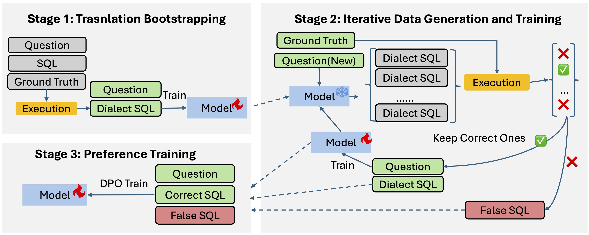

# Exesql: Self-Taught Text-to-SQL Models with Execution-Driven Bootstrapping for SQL Dialects
This repository contains the official implementation of ExeSQL.

## 🧭 Overview


**Figure:** *Pipeline for Dialect Text-to-SQL Data Generation and Model Training.*  
The framework consists of three stages:  
(1) **Translation Bootstrapping**: A bootstrap text-to-SQL model is fine-tuned using SQL translations from an existing dataset (e.g., SQLite) to other dialects (e.g., MySQL, PostgreSQL).  
(2) **Iterative Data Generation and Training**: The model generates multiple SQL candidates per question, which are validated via execution feedback. Correct queries are retained to refine the dataset, enabling iterative self-improvement.  
(3) **Preference Enhancement**: A Direct Preference Optimization (DPO) step is applied to distinguish correct and incorrect SQL queries. High-quality pairs (question, correct SQL) are used to further improve the model’s performance and preference learning, ensuring both correctness and efficiency in SQL generation.

## 📊 Main Results
### Performance Comparison of LLMs on SQL Benchmarks

**General Purposed LLM**

| Method               | Model size | PostgreSQL Spider | PostgreSQL WikiSQL | MySQL Spider | MySQL WikiSQL | MySQL Bird | Oracle Spider | Average |
|----------------------|------------|-------------------|--------------------|--------------|----------------|-------------|----------------|---------|
| GPT-4o               | -          | 54.59             | 58.97              | 62.09        | 57.24          | 36.38       | 64.86          | 55.69   |
| Gemini-1.5-pro       | -          | 51.03             | 54.10              | 64.90        | 51.95          | 36.11       | 65.21          | 53.88   |
| Llama3.1-Instruct    | 8B         | 33.63             | 31.60              | 48.86        | 25.41          | 24.58       | 30.00          | 32.35   |

**Code Expert LLM**

| Method               | Model size | PostgreSQL Spider | PostgreSQL WikiSQL | MySQL Spider | MySQL WikiSQL | MySQL Bird | Oracle Spider | Average |
|----------------------|------------|-------------------|--------------------|--------------|----------------|-------------|----------------|---------|
| Deepseek-Coder       | 7B         | 37.31             | 18.12              | 49.60        | 24.67          | 16.00       | 50.77          | 32.75   |
| Qwen-Coder           | 7B         | 36.80             | 15.48              | 39.04        | 22.84          | 15.36       | 58.31          | 31.31   |
| Magicoder            | 7B         | 21.90             | 17.45              | 47.28        | 23.32          | 13.23       | 26.60          | 24.96   |
| WizardCoder          | 15B        | 23.78             | 16.91              | 32.36        | 20.56          | 18.38       | 36.33          | 24.72   |

**SQL Expert LLM**

| Method               | Model size | PostgreSQL Spider | PostgreSQL WikiSQL | MySQL Spider | MySQL WikiSQL | MySQL Bird | Oracle Spider | Average |
|----------------------|------------|-------------------|--------------------|--------------|----------------|-------------|----------------|---------|
| CodeS                | 7B         | 24.76             | 20.00              | 35.60        | 23.00          | 14.41       | 37.40          | 25.86   |
| StructLLM            | 7B         | 38.71             | 30.97              | 44.20        | 7.14           | 22.69       | 33.16          | 29.48   |

**Our Method**

| Method               | Model size | PostgreSQL Spider | PostgreSQL WikiSQL | MySQL Spider | MySQL WikiSQL | MySQL Bird | Oracle Spider | Average |
|----------------------|------------|-------------------|--------------------|--------------|----------------|-------------|----------------|---------|
| **ExeSQL**           | 7B         | **69.86**         | **74.10**          | **72.09**    | **73.64**      | **41.13**   | **69.35**      | **66.70** |

## Implemention

## Implementation

### 1. Environment Setup

First, ensure you have all the necessary dependencies installed. We highly recommend doing this within a virtual environment (e.g., `venv` or `conda`).

```bash
# (Optional, but recommended) Create and activate a new virtual environment
python -m venv venv
source venv/bin/activate  # On Windows: .\venv\Scripts\activate

# Install all required packages
pip install -r requirements.txt

### 2. Run Inference
You can use the local_generate_sql.py script to generate SQL queries. This script utilizes vLLM for high-throughput inference.

Run the code:
```bash
python local_generate_sql.py \
    --data_file /path/to/your/input_data.json \
    --output_file /path/to/your/predictions.txt \
    --model_name_or_path /path/to/your/huggingface_model \
    --db_base_dir /path/to/spider_data/test_database \
    --sql_dialect "PostgreSQL" \
    --gpu "0" \
    --batch_size 32
